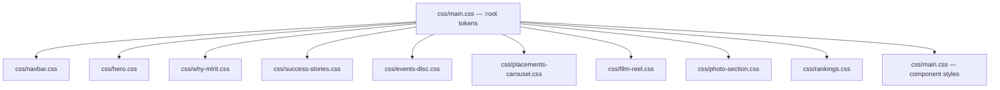
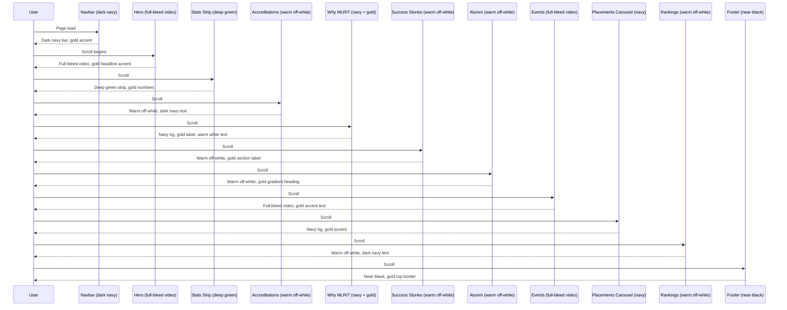

# Design Document: Premium Palette Redesign — MLRIT Website

## Overview

The MLRIT website currently uses a functional but visually inconsistent palette — a mix of forest green (`#18453B`), orange (`#E85D1F`), gold (`#C8960C`), and near-black backgrounds. The goal is to unify and elevate the visual language into a cohesive **premium dark-luxury aesthetic** inspired by top-tier university and tech brand websites (MIT, IIT Bombay, Apple, Vercel). The redesign preserves all existing layout structure and interactivity while replacing color tokens, typography weights, surface treatments, and micro-detail finishes across all 10 CSS files.

The premium direction is: **deep navy/charcoal foundations, refined gold accents, crisp white typography, subtle glassmorphism surfaces, and restrained use of a single warm accent color** — moving away from the current orange-heavy, high-contrast approach toward something more editorial and authoritative.

---

## Architecture

The redesign is purely a CSS-layer change. No HTML structure, JavaScript logic, or asset files are modified. All changes flow from a single source of truth: a revised `:root` token block in `css/main.css`, which cascades into all component stylesheets.



---

## Premium Color Palette

### Core Token Definitions

| Token | Old Value | New Value | Role |
|---|---|---|---|
| `--navy` | — | `#0B0F1A` | Primary dark background (replaces `#1c1c1c`, `#0a0a0a`, `#0f0f0f`) |
| `--navy-mid` | — | `#111827` | Secondary surface (cards, panels) |
| `--navy-light` | — | `#1E2A3A` | Elevated surface (hover states, borders) |
| `--gold` | `#C8960C` | `#C9A84C` | Primary accent — warm, refined gold |
| `--gold-light` | — | `#F0D080` | Gold highlight / text shimmer |
| `--gold-muted` | — | `rgba(201,168,76,0.15)` | Subtle gold tint for backgrounds |
| `--green` | `#18453B` | `#1A3A2E` | Institutional green (kept, darkened) |
| `--green-accent` | — | `#2A6B5A` | Lighter green for hover/active |
| `--white` | `#fff` | `#F8F6F1` | Warm white (not pure white) |
| `--text-primary` | `#0f0f0f` | `#F8F6F1` | Primary text on dark surfaces |
| `--text-secondary` | `#444` | `rgba(248,246,241,0.65)` | Secondary text |
| `--text-muted` | `#888` | `rgba(248,246,241,0.38)` | Muted/caption text |
| `--border` | `#e8e8e8` | `rgba(201,168,76,0.18)` | Default border — gold-tinted |
| `--border-subtle` | — | `rgba(255,255,255,0.07)` | Subtle dividers on dark surfaces |
| `--radius` | `14px` | `12px` | Slightly tighter radius for premium feel |

### Light Surface Tokens (Rankings, Accreditations)

| Token | Value | Role |
|---|---|---|
| `--surface-light` | `#F4F1EA` | Warm off-white for light sections |
| `--surface-card` | `#FFFFFF` | Pure white card backgrounds |
| `--text-on-light` | `#0B0F1A` | Dark navy text on light surfaces |
| `--green-on-light` | `#1A3A2E` | Institutional green on light bg |

---

## Architecture & Sequence Diagrams

### Page Scroll Flow — Color Zones



---

## Components and Interfaces

### 1. Global Token Layer (`css/main.css` — `:root`)

**Purpose**: Single source of truth for all color, typography, and spacing tokens.

**Interface**:
```css
:root {
  /* Dark surfaces */
  --navy:          #0B0F1A;
  --navy-mid:      #111827;
  --navy-light:    #1E2A3A;

  /* Accent */
  --gold:          #C9A84C;
  --gold-light:    #F0D080;
  --gold-muted:    rgba(201,168,76,0.15);

  /* Institutional green */
  --green:         #1A3A2E;
  --green-accent:  #2A6B5A;
  --green-light:   #e8f2ee;

  /* Light surfaces */
  --surface-light: #F4F1EA;
  --surface-card:  #FFFFFF;

  /* Typography */
  --text-primary:   #F8F6F1;
  --text-secondary: rgba(248,246,241,0.65);
  --text-muted:     rgba(248,246,241,0.38);
  --text-on-light:  #0B0F1A;

  /* Borders */
  --border:        rgba(201,168,76,0.18);
  --border-subtle: rgba(255,255,255,0.07);

  /* Misc */
  --radius:        12px;
  --serif:         'Playfair Display', Georgia, serif;
  --sans:          'Inter', 'Segoe UI', Arial, sans-serif;
  --display:       'Sora', 'Segoe UI', Arial, sans-serif;
}
```

---

### 2. Navbar (`css/navbar.css`)

**Purpose**: Top navigation bar — masthead + main nav.

**Changes**:
- Masthead: `background: #fff` → `background: var(--navy-mid)` with `border-bottom: 1px solid var(--border-subtle)`
- Masthead tagline color: `#18453B` → `var(--gold)`
- Main nav background: `#18453B` → `var(--navy)` with a `border-bottom: 1px solid var(--border-subtle)`
- Nav link color: `#fff` → `var(--text-primary)`
- Nav link hover underline: `#fff` → `var(--gold)`
- Dropdown: `background: #fff` → `background: var(--navy-mid)`, `border-top: 3px solid var(--gold)`
- Dropdown heading color: `#18453B` → `var(--gold)`, border-bottom color → `var(--gold)`
- Dropdown link color: `#333` → `var(--text-secondary)`, hover → `var(--gold)`
- EAPCET button: `background: #E85D1F` → `background: var(--gold)`, `color: #fff` → `color: var(--navy)`
- Support panel: `background: #fff` → `background: var(--navy-mid)`, text colors updated
- Support panel call circle: `fill: #18453B` → `fill: var(--gold)`, icon fill → `var(--navy)`

---

### 3. Hero (`css/hero.css`)

**Purpose**: Full-bleed video hero with headline and CTA.

**Changes**:
- Gradient overlay: bottom color `rgba(0,0,0,0.75)` → `rgba(11,15,26,0.85)` (navy tint)
- `h1` color: `#fff` → `var(--text-primary)`
- `h1 span` (accent line): `color: #f5c518` → `color: var(--gold)`
- `h1 span em` (outline text): `-webkit-text-stroke: 1.5px #f5c518` → `-webkit-text-stroke: 1.5px var(--gold)`, glow → `rgba(201,168,76,0.4)`
- `p` color: `rgba(255,255,255,0.78)` → `var(--text-secondary)`
- `btn-primary`: `background: #f5c518` → `background: var(--gold)`, `color: #111` → `color: var(--navy)`
- `btn-primary:hover`: `background: #e0b000` → `background: var(--gold-light)`
- `btn-outline`: border → `rgba(201,168,76,0.6)`, hover bg → `rgba(201,168,76,0.12)`
- Scroll indicator line gradient: white → gold (`var(--gold)`)
- Scroll drop animation color: `#f5c518` → `var(--gold)`

---

### 4. Stats Strip (`css/main.css` — `.stats-strip`)

**Purpose**: 4-column KPI strip below hero.

**Changes**:
- Background: `var(--green)` → `var(--green)` (kept — institutional green is premium here)
- `stat-item__number span` (suffix): `color: var(--gold)` → `color: var(--gold-light)` (brighter on dark green)
- `stat-item__label`: `rgba(255,255,255,0.65)` → `rgba(248,246,241,0.55)`
- Border between items: `rgba(255,255,255,0.12)` → `rgba(201,168,76,0.15)`

---

### 5. Achievements / Accreditations (`css/main.css` — `.achievements`)

**Purpose**: Accreditation keyboard + rankings grid on warm off-white.

**Changes**:
- Section background: `#f5f4f1` → `var(--surface-light)`
- Radial gradient tints: green/gold tints updated to use new tokens
- `.section-label` color: `var(--green)` → `var(--green)` (kept — works on light bg)
- `.section-heading` color: `var(--text-dark)` → `var(--text-on-light)`
- `.rank-row__num` color: `var(--green)` → `var(--green)`
- `.rank-row__info strong` color: `var(--text-dark)` → `var(--text-on-light)`
- `.accred-key` background: `linear-gradient(135deg, #2d2d2d, #1a1a1a)` → `linear-gradient(135deg, var(--navy-light), var(--navy-mid))`
- `.accred-key:hover` glow: `rgba(232,93,31,0.3)` → `rgba(201,168,76,0.35)`
- `.accred-key:hover img` filter: orange drop-shadow → gold drop-shadow

---

### 6. Why MLRIT (`css/why-mlrit.css`)

**Purpose**: Two-column section with text left, video right, on dark background.

**Changes**:
- Section background: `#1c1c1c` → `var(--navy)`
- Section border-bottom: `rgba(255,255,255,0.06)` → `var(--border-subtle)`
- `.section-label` color: `#E85D1F` → `var(--gold)`
- `.why-section__heading` color: `#fff` → `var(--text-primary)`
- `.why-section__body` color: `rgba(255,255,255,0.52)` → `var(--text-secondary)`
- Video box-shadow border: `rgba(255,255,255,0.06)` → `var(--border-subtle)`
- Video playing state glow: `rgba(232,93,31,0.25)` → `rgba(201,168,76,0.3)`

---

### 7. Success Stories (`css/success-stories.css`)

**Purpose**: Infinite horizontal belt of success story cards.

**Changes**:
- Section background: `#efede8` → `var(--surface-light)`
- Edge fade gradients: `#f7f7f5` → `var(--surface-light)`
- `.ss-header .section-label` color: `var(--green, #18453B)` → `var(--green)`
- `.ss-card` background: `#1a1a1a` → `var(--navy-mid)`
- `.ss-card` box-shadow border: `rgba(24,69,59,0.2)` → `var(--border)`
- `.ss-card:hover` outline: `#E85D1F` → `var(--gold)`

---

### 8. Alumni Network (`css/main.css` — `.alumni-section`)

**Purpose**: Alumni video cards on warm off-white.

**Changes**:
- Section background: `#f3f1ec` → `var(--surface-light)`
- `.section-heading` gradient: `var(--green) → #2a6b5a → var(--gold)` → `var(--green) → var(--green-accent) → var(--gold)` (same direction, updated tokens)
- `.alumni-card` background: `rgba(255,255,255,0.9)` → `rgba(255,255,255,0.92)`
- `.alumni-card` border: `rgba(24,69,59,0.12)` → `rgba(26,58,46,0.15)`
- Orange sweep (`::before`): `#E85D1F` → `var(--gold)` (gold sweep instead of orange)
- Blue overlay (`::after`): `#0f1a5e` → `var(--navy)` (navy instead of blue)
- `.alumni-company` color: `#E85D1F` → `var(--gold)`
- `.alumni-play-hint` color: `#E85D1F` → `var(--gold)`
- Mute button hover: orange → gold

---

### 9. Events (`css/events-disc.css`)

**Purpose**: Full-screen video events section with overlay UI.

**Changes**:
- Section background: `#0a0a0a` → `var(--navy)`
- `.ev-explore em` color: `#E85D1F` → `var(--gold)`
- `.ev-text__meta strong` color: `#fff` → `var(--text-primary)`
- `.ev-text__meta span` color: `rgba(255,255,255,0.55)` → `var(--text-muted)`
- `.ev-ctrl-btn:hover` and `.ev-mute-btn:hover`: orange → gold (`rgba(201,168,76,0.4)`, border `rgba(201,168,76,0.7)`)
- `.ev-mini-thumb.is-active` border: `#fff` → `var(--gold)`
- Beam gradient: `rgba(232,93,31,0.20)` → `rgba(201,168,76,0.20)`
- `.ev-main-thumb__play-text` color: `#E85D1F` → `var(--gold)`

---

### 10. Placements Carousel (`css/placements-carousel.css`)

**Purpose**: Horizontal drag-scroll card carousel on dark background.

**Changes**:
- Section background: `#0f0f0f` → `var(--navy)`
- `.section-label` color: `#E85D1F` → `var(--gold)`
- `.section-heading` color: `#fff` → `var(--text-primary)`, font-family → `var(--display)` (consistent)
- `.section-sub` color: `rgba(255,255,255,0.5)` → `var(--text-secondary)`
- `.placements-carousel__view-all` color: `#E85D1F` → `var(--gold)`, border → `var(--gold)`
- `.placement-card` background: `#1a1a1a` → `var(--navy-mid)`
- `.placement-card` border: `rgba(255,255,255,0.08)` → `var(--border-subtle)`
- `.placement-card:hover` border: `#E85D1F` → `var(--gold)`

---

### 11. Film Reel (`css/film-reel.css`)

**Purpose**: Animated film strip section on white background.

**Changes**:
- Section background: `#fff` → `var(--surface-card)`
- `.section-label` color: `#E85D1F` → `var(--gold)`
- `h2` color: `#111` → `var(--text-on-light)`
- `p` color: `#666` → `rgba(11,15,26,0.55)`
- `.film-viewport` background: `#111` → `var(--navy)`
- Viewport fade gradients: `#111` → `var(--navy)`
- `.film-frame:hover` border: `rgba(232,93,31,0.6)` → `rgba(201,168,76,0.6)`
- `.film-upload-hint__dot` background: `#E85D1F` → `var(--gold)`

---

### 12. Photo Section (`css/photo-section.css`)

**Purpose**: Editorial photo grid with caption overlays.

**Changes**:
- `--ps-orange`: `#E85D1F` → `var(--gold)` (or `#C9A84C` directly since it's a local token)
- `--ps-orange-light`: `#FDF0EA` → `#F8F3E3`
- `--ps-orange-dark`: `#7A2E0B` → `#6B5020`
- `--ps-bg`: `#F7F7F7` → `var(--surface-light)` / `#F4F1EA`
- `.photo-section__heading` color: `var(--ps-orange)` → `var(--gold)` / `#C9A84C`
- Hero tile caption background: `var(--ps-orange)` → `var(--gold)` / `#C9A84C`
- `.tile__badge` background: `var(--ps-orange)` → `var(--gold)` / `#C9A84C`

---

### 13. Rankings (`css/rankings.css`)

**Purpose**: Rankings + accreditation glare cards on white.

**Changes**:
- Section background: `#fff` → `var(--surface-card)`
- Border-bottom: `#ebebeb` → `rgba(11,15,26,0.08)`
- `.section-label` color: `#18453B` → `var(--green)`
- `h2` color: `#0f0f0f` → `var(--text-on-light)`
- `.rank-number` color: `#18453B` → `var(--green)`
- `.rank-text strong` color: `#111` → `var(--text-on-light)`
- `.rank-text span` color: `#999` → `rgba(11,15,26,0.45)`
- `.glare-hover` background: `#fff` → `var(--surface-card)`
- `.glare-hover` border: `#e8e8e8` → `rgba(11,15,26,0.1)`
- Glare shimmer: `rgba(255,255,255,0.6)` → `rgba(201,168,76,0.5)` (gold glare)

---

### 14. Placements Section (`css/main.css` — `.placements`)

**Purpose**: Stats + recruiter band on green background.

**Changes**:
- Background: `var(--green)` → `var(--green)` (kept — deep institutional green)
- `placement-stat__num .unit` color: `var(--gold)` → `var(--gold-light)`
- `placement-stat__label` color: `rgba(255,255,255,0.55)` → `rgba(248,246,241,0.5)`
- Recruiter band fade gradients: `var(--green)` → `var(--green)` (kept)
- `.recruiter-band__item` border-radius: `14px` → `10px`

---

### 15. Footer (`css/main.css` — `.site-footer`)

**Purpose**: Dark footer with brand, links, socials.

**Changes**:
- Background: `#0a0a0a` → `var(--navy)`
- Top gradient border: `#18453B → #E85D1F` → `var(--green) → var(--gold)`
- `.footer__col h5` color: `rgba(255,255,255,0.85)` → `var(--text-primary)`
- `.footer__col ul li a` color: `rgba(255,255,255,0.45)` → `var(--text-muted)`
- `.footer__col ul li a:hover` color: `#fff` → `var(--text-primary)`
- Footer link underline: `#E85D1F` → `var(--gold)`
- Social icon hover: `border-color: #E85D1F` → `var(--gold)`, glow → `rgba(201,168,76,0.4)`
- `.footer__bottom` color: `rgba(255,255,255,0.3)` → `rgba(248,246,241,0.25)`

---

## Data Models

### Color Token Map

```css
/* Premium Palette — complete token reference */
:root {
  /* === Dark Surfaces === */
  --navy:           #0B0F1A;   /* deepest bg */
  --navy-mid:       #111827;   /* card/panel bg */
  --navy-light:     #1E2A3A;   /* elevated surface */

  /* === Gold Accent === */
  --gold:           #C9A84C;   /* primary accent */
  --gold-light:     #F0D080;   /* highlight / on-dark text accent */
  --gold-muted:     rgba(201,168,76,0.15); /* tint bg */

  /* === Institutional Green === */
  --green:          #1A3A2E;   /* primary green */
  --green-accent:   #2A6B5A;   /* lighter green */
  --green-light:    #e8f2ee;   /* very light green tint */

  /* === Light Surfaces === */
  --surface-light:  #F4F1EA;   /* warm off-white sections */
  --surface-card:   #FFFFFF;   /* pure white cards */

  /* === Typography === */
  --text-primary:   #F8F6F1;   /* warm white — on dark */
  --text-secondary: rgba(248,246,241,0.65);
  --text-muted:     rgba(248,246,241,0.38);
  --text-on-light:  #0B0F1A;   /* navy — on light */

  /* === Borders === */
  --border:         rgba(201,168,76,0.18);  /* gold-tinted */
  --border-subtle:  rgba(255,255,255,0.07); /* dark surface dividers */

  /* === Misc === */
  --radius:         12px;
}
```

---

## Correctness Properties

- Every dark-background section (`--navy`, `--navy-mid`) must use `--text-primary` or `--text-secondary` for body text — never raw `#fff` or `rgba(255,255,255,x)`
- Every light-background section (`--surface-light`, `--surface-card`) must use `--text-on-light` for headings — never `--text-primary`
- The gold accent (`--gold`) must appear on at least one element per section as a visual anchor
- No raw hex color values for the primary palette should remain in component CSS files after the redesign — all must reference CSS custom properties
- The institutional green (`--green`) is used exclusively for the stats strip background, placements section background, navbar background, and on-light-surface label/rank colors
- Orange (`#E85D1F`) must be fully replaced — zero remaining instances in any CSS file
- Contrast ratios: `--text-primary` on `--navy` ≥ 7:1 (AAA), `--gold` on `--navy` ≥ 4.5:1 (AA)

---

## Error Handling

### Scenario 1: CSS Variable Fallback

**Condition**: Browser does not support CSS custom properties (very old browsers)
**Response**: Each `var()` call includes a hardcoded fallback value
**Recovery**: `color: var(--gold, #C9A84C)` — site degrades gracefully with hardcoded values

### Scenario 2: Partial Application

**Condition**: A component CSS file is not updated but `main.css` tokens change
**Response**: Component retains old hardcoded colors, creating visual inconsistency
**Recovery**: All 10 CSS files must be updated atomically in the same deployment

### Scenario 3: Contrast Failure

**Condition**: A new color combination fails WCAG AA contrast ratio
**Response**: Identified during design review before implementation
**Recovery**: Adjust lightness of `--gold-light` or `--text-secondary` opacity upward

---

## Testing Strategy

### Visual Regression Testing

Each section should be visually reviewed at:
- 1440px (desktop)
- 1024px (tablet landscape)
- 768px (tablet portrait)
- 375px (mobile)

Key checkpoints per section:
- Navbar: masthead bg, nav bg, dropdown bg/text, EAPCET button
- Hero: headline gold accent, CTA button color, scroll indicator
- Stats strip: number gold suffix, label readability
- Accreditations: keyboard key bg, glare effect color
- Why MLRIT: section bg, label color, video glow on play
- Success Stories: card bg, hover outline color
- Alumni: sweep color (gold), overlay color (navy), company name color
- Events: explore text accent, control button hover, beam color
- Placements Carousel: card bg, hover border, section label
- Film Reel: section label, frame hover border
- Photo Section: hero caption bg, badge bg
- Rankings: glare shimmer color, rank number color
- Footer: top border gradient, social hover color

### Contrast Ratio Checks

| Combination | Ratio Target | Tool |
|---|---|---|
| `#F8F6F1` on `#0B0F1A` | ≥ 7:1 (AAA) | WebAIM Contrast Checker |
| `#C9A84C` on `#0B0F1A` | ≥ 4.5:1 (AA) | WebAIM Contrast Checker |
| `#C9A84C` on `#111827` | ≥ 4.5:1 (AA) | WebAIM Contrast Checker |
| `#0B0F1A` on `#F4F1EA` | ≥ 7:1 (AAA) | WebAIM Contrast Checker |
| `#1A3A2E` on `#F4F1EA` | ≥ 4.5:1 (AA) | WebAIM Contrast Checker |

### Property-Based Testing Approach

Not applicable for a pure CSS visual redesign. Testing is manual/visual + contrast ratio tooling.

---

## Performance Considerations

- No new web fonts are introduced — existing Inter, Sora, Playfair Display stack is unchanged
- CSS custom properties add negligible runtime cost
- No new images, gradients, or filters are added — only color value changes
- The `backdrop-filter` usage on existing glassmorphism elements is unchanged

---

## Security Considerations

No security implications — this is a purely visual CSS change with no data handling, authentication, or user input involved.

---

## Dependencies

- Existing Google Fonts: Inter, Sora, Playfair Display (unchanged)
- No new external dependencies
- All 10 CSS files must be updated in the same release
- `css/main.css` `:root` block is the single source of truth and must be updated first
